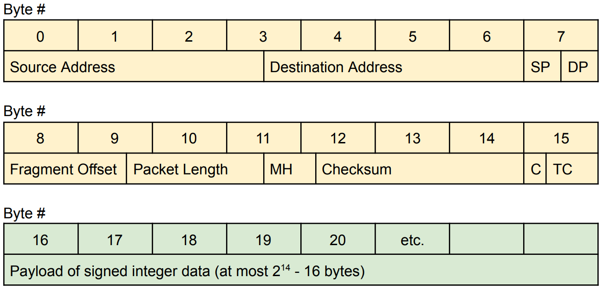

# Array Packetizer
`functions.c` is a set of functions to convert an array of 32-bit signed integers into network packets and back with bitwise operations. 

> [!IMPORTANT]
> `functions.c` does not do anything on its own, as this file is intended for use within a larger project.

The functions depend on a fictional packet structure, detailed below. 

## Packet structure:

There always exists a 16-byte header that contains:
- 28-bit Source Address
- 28-bit Destination Address
- 4-bit Source Port
- 4-bit Destination Port
- 14-bit Fragment Offset
- 14-bit Packet Length
- 5-bit Maimum Hop Count
- 23-bit Checksum
- 2-bit Compression Scheme
- 6-bit Traffic Class

After the header comes the payload, containing anywhere from 0 to 16.368 kilobytes of array data.

> [!NOTE]
> The functions written will depacketize correctly even if the packets arrive out of order, and it will check for corruption by computing the checksum!